# Solution for Week 0 Assignment 


### 1. 
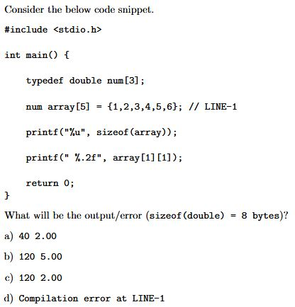

Output: 
```
120 5.00
```
>answer: `b`

Solution:
The first `printf()` statement is using the `sizeof()` operator to get the size of the array variable in bytes. Since each element of the array is an array of 3 doubles, which are 8 bytes each, the total size of the array is 5 * 8 * 3 = 120 bytes.

The second `printf()` statement is printing the value of `array[1][1]`, which is the second element of the second sub-array within the main array. Since the array is initialized with `{1,2,3,4,5,6}`, so array becomes, 
``` 
a[0][0] = 1
a[0][1] = 2
a[0][2] = 3
a[1][0] = 4
a[1][1] = 5
a[1][2] = 6
```
---
### 2. 
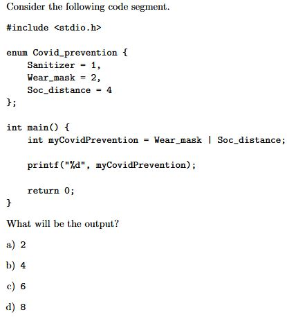

Output:
```
6
```
>answer: `c`

Solution: 
Printf statement returns the value of `myCovidPrevention` variable. 
`myCovidPrevention` variable assigns to bitwise OR operator of `Wear_mask` and `Soc_distance` variable.

```
Wear_mask = 2 (010)
Soc_distance = 4 (100)

So result is 010 | 100 = 110 (6)  
```
---
### 3. 
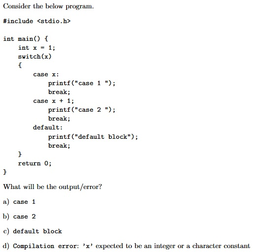

Output: 
```
Case label does not reduce to an integer constant.
Compilation error: case must be integer or char constant.
```
>answer: `d`

Solution:
In switch statement, every case statement ust contains a constant value such as integer or a character etc.

---

### 4. 
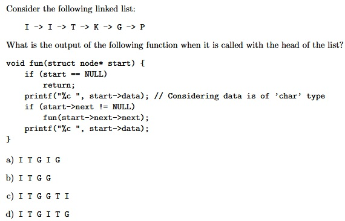

Output:
```
ITGGTI
```
>answer: `c`

Solution: 
I -> I -> T -> K -> G -> P

For above linked list,
* At first, start node will be the `I NODE` , checks for start is NULL, it will return False so, it will first print the NODE data `I`, then it checks if next node is not null, it's not null so it will call itself with aargument of start->next->next. 
* At second, fun is called with start->next->next. So it takes `T NODE` as a argument. same step follows. Prints `T`, then it will move to fun(next next)
*  At third, fun is called with `G NODE` prints `G` and start-> next(`P` NODE ! = NULL). So fun(start->next->next)=>func(`P NODE`->next [NULL])=>func(NULL)
* At fourth, something happens, start is NULL, so it returns, and goes back to previous executed function and prints the data which is letter `G`.
* It continues and Prints `T` and `I`.

---
### 5.
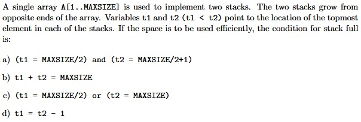

>answer: `d`

```c
void push1(){
    int item;
    if(t1 == t2-1){
        printf("\nSTACK OVERFLOW");
        return;
    }
    printf("\nEnter item: ");
    scanf("%d", &item);
    t1++;
    A[t1] = item;
}
```

---
### 6.
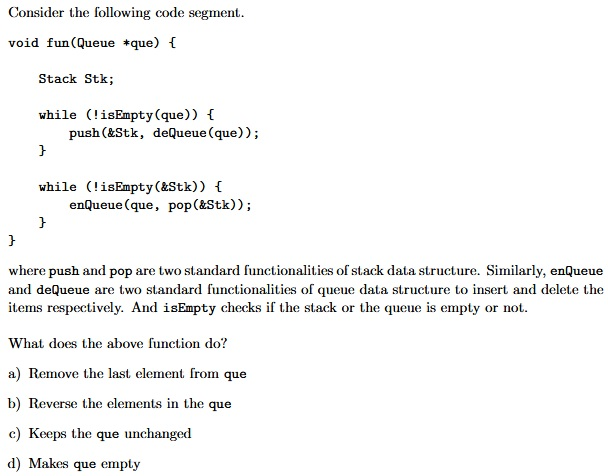

>answer: `b`

Solution: This function appears to take a pointer to a Queue data structure as its parameter, and it uses that Queue to reverse the order of the elements within it. It creates a Stack data structure called "Stk", and then uses a while loop to dequeue elements from the Queue and push them onto the Stack, until the Queue is empty. Then, it uses another while loop to pop elements from the Stack and enqueue them back into the original Queue, reversing their order. The function is using two helper functions "isEmpty" and "pop" which are not defined here but it can be assumed that these functions check if the data structure is empty or pop out an element from a stack.

---
### 7.
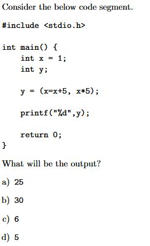

Output
```
30
```
>answer: `b`

Solution: 

This is a simple C program that assigns the value of x to x+5 (i.e. x becomes 6) and then assigns the value of x*5 to y (i.e. y becomes 30). Then it uses the printf() function to print the value of y on the screen.

When this program is compiled and run, it will output the number 30

---

### 8.
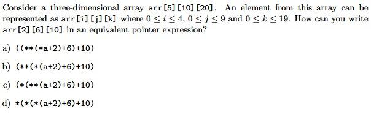

Program: 
```c
#include<stdio.h>


int main(){
    int arr[5][10][20];
    int res;
    arr[2][6][10] = 100;

    res = ((**(*arr+2)+6)+10);
    printf("\n%d", res);
    
    res = (**(*(arr+2)+6)+10);
    printf("\n%d", res);

    res = (*(**(arr+2)+6)+10);
    printf("\n%d", res);

    res = *(*(*(arr+2)+6)+10);
    printf("\n%d", res);

    return 0;
}
```
Output
```
100
```

>answer: `d`


---
### 9.
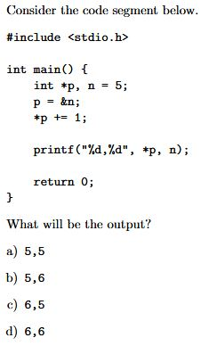

Output
```
6, 6
```
>answer: `d` 

Solution: 

p = &n // p is the address of n

*p +=1  // Adds 1 to the value of n

---
### 10.
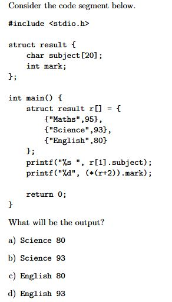

Output
```
Science 80
```
>answer: `a`

Solution: First print statement gives the subject of 2nd result. And second print statement gives the marks of (r+2) means, pointer arithmetic in array, so it goes to index 2, in index 2 English subject is there. So marks of english will be printed.

---
### 11.
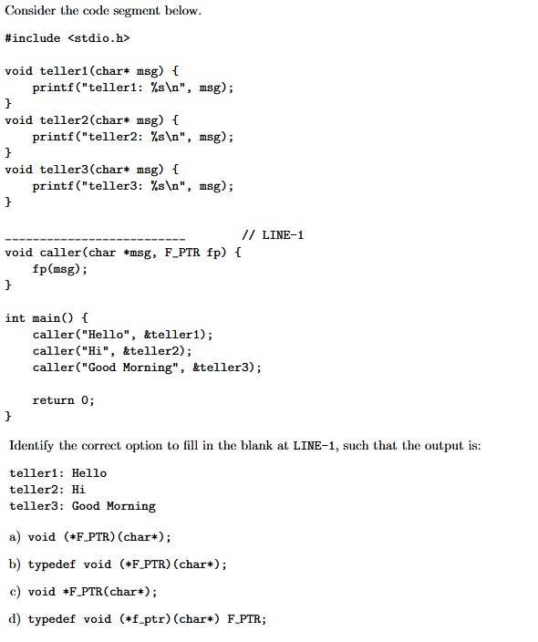

Output
```
teller1: Hello
teller2: Hi
teller3: Good Morning
```
>answer: `b`

Solution: 
```c
typedef void (*F_PTR)(char*);
```
This line of code defines a new type called "F_PTR" which is a pointer to a function that takes a single parameter of type "char*" and returns "void". The function pointer can be used to point to a specific function that matches this signature and can be invoked using the function pointer.

---
### 12.
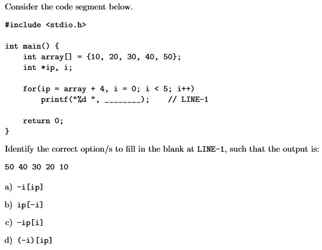

Output
```
50 40 30 20 10
```
>answer: `b`

Solution: So consider below program, 
```c 
#include<stdio.h>


int main(int argc, char const *argv[])
{
    int array[] = {10, 20, 30, 40, 50};
    int *ip, i;

    for(ip = array+4, i=0; i<5; i++)
        printf("%d ", ip[-i]);
    return 0;
}
```
This program creates an array of integers called "array" with the values {10, 20, 30, 40, 50}. It then creates a pointer to an integer called "ip" and sets it to point to the last element of the array. Then, it uses a for loop to print out the values of the array starting from the last element and going in reverse order by using the pointer "ip" and negative indexing. The program will print the numbers 50, 40, 30, 20, 10 each on a new line.


---
### 13.
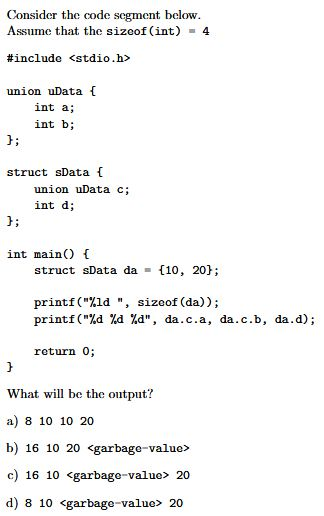

Output
```
8 10 10 20
```
>answer: `a`

Solution: 
So, I have written a visual representation of how this code works.
```c
struct sData {
    union uData {
        int a;
        int b;
    } c;
    int d;
} da = {10, 20};
```
First printf statement prints the size of da, which is 8, because da consist of union with two integer variable, compiler allots size of union as largest sizeof all the variable. So union size will be 4.
then int d size will be 4. Total is 4 + 4 = 8.

union is equal to 10. c.a = 10 & c.b = 10.

da.c.a => 10\
da.c.b => 10\
da.d => 20

---
### 14.
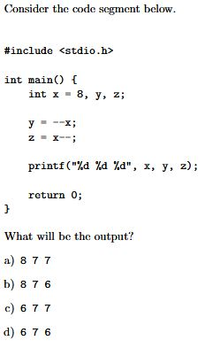

Output
```
6 7 7
```
>answer: `c`

Solution: In the first statement, the value of x is decremented by 1 using the decrement operator (--) before its value is assigned to the variable y. So, after this statement, the value of x is 7 and y is also 7.

In the second statement, the value of x is assigned to the variable z and then decremented by 1 using the post-decrement operator (--). So, after this statement, the value of x is 6 and z is 7.

The final printf statement outputs the values of x, y, and z: 6 7 7

---
### 15.
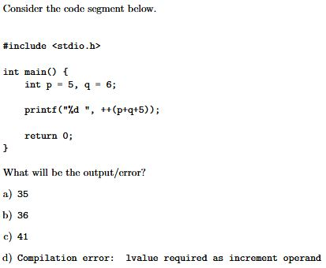

Output
```
Compilation error: expression must be a modifiable lvalue.
```
>answer: `d`

---